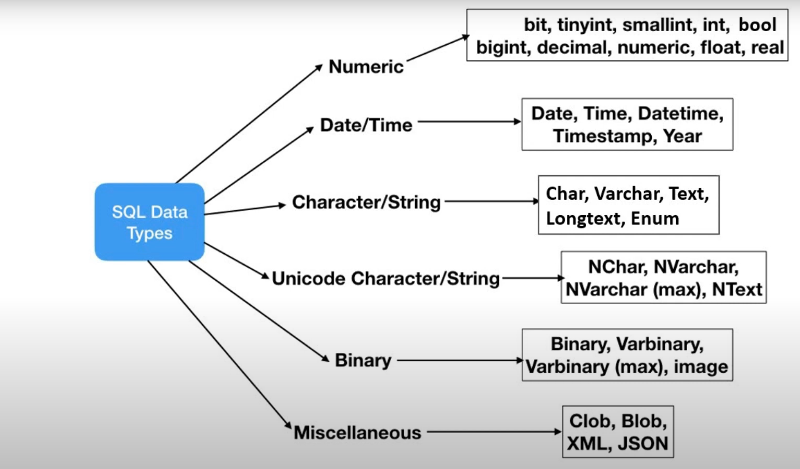

# Data types

Data types - rules taht defines what kind of value perticular column will store. We define it while structuring table.

Restrict the type of data being saved, efficient storage and allows alternate sorting orders.

As if we store 1 to 10 as a string then the sorting will be different then integer values.

There is a important difference between char and varchar

In char if our string is "Hiren" and we defined it as a char(20) then it will take all 20 bytes of data where the last 15 will be filled with NULL.

In varachar if our string is "Hiren" and we defined it as a varchar(20) then it will take 5 bytes for "Hiren" and 2 bytes for length of the string in total of 7.

Secondly, storing numbers that starts with 0 like zip code 01234 etc - are tricky as if we store them into the integer then we will simply loose 0, that is why it is advice to store them into varchar

Rule of thumb is If number is used for arithamtic calculations like sum, average etc then go for integer otherwise (litreral) varchar.

0 is false non-0 is true in bool

Be causiate with datetime and using cascade like on update or default values as it will change the data.
