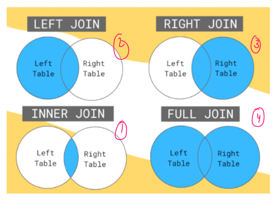

### JOINS

https://drive.google.com/file/d/17K-6H-Vpgc2PGO547tHX9-fTyHluq8DH/view

When the data is distributed in multiple tables and we need to retrive data from them we use joins that creates a virtual table based on related columns between those tables.

_⚠ The criteria to perform join is that tables must have atleast one column common between them._

1. Left / Left Outer
2. Right
3. Inner
4. Full / Full Outer
5. Self
6. Cross

### CROSS

A = {1,2} and B = {3,4} Then Cartesian product A x B = (1,3),(1,4),(2,3),(2,4)

### INNER

### LEFT / LEFT Outer

### RIGHT / RIGHT Outer
