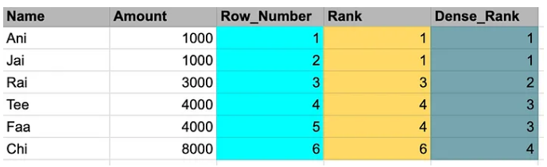
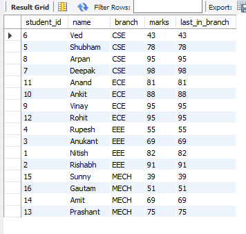
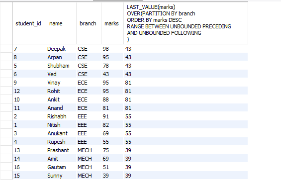
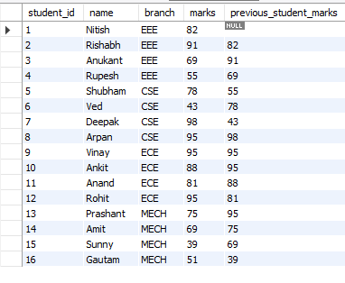
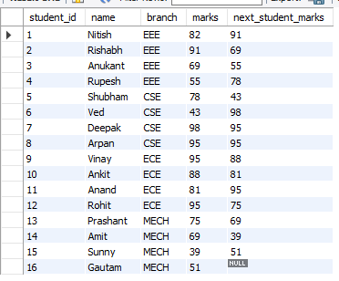

# Window Functions

Window functions in sql are the functions that allows to perform calculations across a specific set of rows releted to the current row.

| Concept               | `GROUP BY`                                                    | `OVER()`(Window Functions)                                  |
| --------------------- | ------------------------------------------------------------- | ----------------------------------------------------------- |
| **Purpose**           | Aggregates data into**one row per group and collapsing them** | Performs calculations**across rows**without collapsing them |
| **Output Rows**       | **Reduces**number of rows                                     | **Keeps**all original rows                                  |
| **Use Case**          | Summarize data                                                | Compare rows, rank, compute moving averages, etc.           |
| **Example Functions** | `SUM()`,`AVG()`,`COUNT()`                                     | `SUM() OVER()`,`ROW_NUMBER() OVER()`,`RANK()`               |

| SQL Concept | Analogy                                                        |
| ----------- | -------------------------------------------------------------- |
| `GROUP BY`  | Grouping people by city and reporting 1 stat per city          |
| `OVER()`    | Giving each person a city-average value while keeping everyone |

Lets say we have a table called 'students' - that has id, name, department, and score. We have 10 students and each has id, name, department and score. There are mainly 2 departments - IT and CS. Our goal is to find the average score of students in each department. To achieve that we use GROUP BY.

```sql
SELECT department, AVG(score)
FROM students
GROUP BY department;
```

This will give us 2 columns x 2 rows table in which we can see the departments (IT,CS) and average score of students in that department.

Now we can do same thing using window function and OVER() clause. Here is what it does.

```sql
SELECT *,
AVG(score) OVER(PARTITION BY score)
FROM students;
```

Here the output will be 5 Columns and 10 rows. Why ? We will have entire row of id, name, departments and scores as it is and we will have new column called 'AVG(score) OVER(PARTITION BY score)' that will give the average score of perticular student based on the department.

This is the fundamental differnce between GROUP BY and OVER() clause. Group by give table that has all the distinct departments and its aggregated values (in this case departmens and AVG(score)), whereas OVER() using PARTITION BY cluse will give use the table that carries all the old values as well as adds new column for each row with aggregated values (in this case the)

## OVER() and Aggregation

Now we have the marks table which has a similar data to students with more rows.

Here we can do the average of each student based on their department/branch.

```sql
SELECT *,
AVG(marks) OVER(PARTITION BY branch)
FROM marks;
```

Similarly, we can do all the other aggregated function with OVER()

```sql
SELECT *,
MAX(marks) OVER(PARTITION BY brach)
FROM marks;

SELECT *,
MIN(marks) OVER(PARTITION BY brach)
FROM marks;

SELECT *,
SUM(marks) OVER(PARTITION BY brach)
FROM marks;

SELECT *,
COUNT(marks) OVER(PARTITION BY brach)
FROM marks;

-- Or

SELECT *,
MAX(marks) OVER(PARTITION BY branch),
MIN(marks) OVER(PARTITION BY branch),
SUM(marks) OVER(PARTITION BY branch)
FORM marks;
```

Similarly if we don't define the PARTITION BY in window function that it will give us the aggreageted values for whole table

```sql
SELECT *,
MAX(marks) OVER(),
MIN(marks) OVER(),
SUM(marks) OVER()
FROM marks;
```

And we can do both within a same query

```sql
SELECT *,
MAX(marks) OVER(PARTITION BY branch),
MIN(marks) OVER(PARTITION BY branch),
SUM(marks) OVER(PARTITION BY branch),
MAX(marks) OVER(),
MIN(marks) OVER(),
SUM(marks) OVER()
FROM marks;
```

## RANK()

Rank give the ranking based on column

Q.1 Give the ranking to students as whole dataset not as per the branch

```sql
SELECT *,
RANK() OVER(ORDER BY marks DESC)
FROM marks;
```

Here intresting to note for the rank function is that if there are two rows or more who gets the same ranking then it will give them a same ranks for an example if there are 3 students who have 98 marks then all of them will get the same rank (for an example their rank is 2 2 2), and then the next row will not get the rank 3 but 5.

Q.2. Rank the students based on marks in each branch.

```sql
SELECT *,
RANK()
OVER(PARTITION BY branch ORDER BY marks DESC)
FROM marks;
```

Q.3. Now lets rank each stundent for overall_rank and branch_rank as well

```sql
SELECT *,
RANK()
OVER(ORDER BY marks DESC)
AS 'overall_rank',
RANK()
OVER(PARTITION BY branch ORDER BY marks DESC)
AS 'branch_rank'
FROM marks;
```

## DENSE_RANK()

As we discussed above that the rank will give the same rank as per the condition and the next rank will be jumped by the total number of same ranks previously given, so for an example if there are three people with 100 marks gets the same rank of 6, then the next person will not get rank 2, instead the rank of next person is 9.

Here DENSE_RANK() instead of giving the fourth person rank of 9 it will give the rank 7.



Q.1. Give dense_rank for each student on whole dataset
Q.2. Give dense rank for each stundet based on branch
Q.3. Give dense rank for both of the above

```sql
SELECT *,
DENSE_RANK()
OVER(ORDER BY marks DESC)
AS 'overall_dense_rank'
FROM marks;
```

```sql
SELECT *,
DENSE_RANK()
OVER(PARTITION BY branch ORDER BY marks DESC)
AS 'branch_dense_rank'
FROM marks;
```

```sql
SELECT *,
DENSE_RANK()
OVER(PARTITION BY branch ORDER BY marks DESC)
AS 'branch_dense_rank',
DENSE_RANK()
OVER(ORDER BY marks DESC)
AS 'overall_dense_rank'
FROM marks;
```

## ROW_NUMBER()

it just assign the row number

Q.1. Add new row as a row_num for overall data

```sql
SELECT *,
ROW_NUMBER()
OVER()
AS 'overall_row_number'
FROM marks;
```

Q.2. Add new row_number for each branch

```sql
SELECT *,
ROW_NUMBER()
OVER(PARTITION BY branch)
AS 'branch_row_number'
FROM marks;
```

Q.3 Create a new column that is made up of department + overall row number of data set and call it unique_student_id

```sql
SELECT *,
ROW_NUMBER()
OVER()
AS 'overall_row_number',
CONCAT(department,'_',ROW_NUMBER() OVER() )
AS 'unique_student_id'
FROM marks;
```

Q.4. Make a unique student email address that has 'name.department@mail.com',

```sql
SELECT *,
CONCAT(name,'.',branch,'@mail.com')
AS 'email'
FROM marks;
```

## QUESTION

Q. Find the top 2 customers from orders table who have spend the most for each month.

There are many things to learn here, first extracting the month. This can be done with few methods.

```sql
SELECT
MONTHNAME(date)
FROM orders;

-- OR

SELECT
MONTH(date)
FROM orders;

-- OR

SELECT
SUBSTRING(date,5,3)
FROM orders;
```

Once we have the month - we will do group by month, and user_id then find the sum for each user

```sql
SELECT user_id,
MONTH(date) AS 'month',
SUM(amount) AS 'total'
FROM orders
GROUP BY user_id,
MONTH(date);
```

Now we will give the rank to each row partitioning with month and order it by spendings

```sql
SELECT user_id,
MONTH(date) AS 'month',
SUM(amount) AS 'total',
RANK()
OVER(PARTITION BY MONTH(date) ORDER BY SUM(amount) )
AS 'month_rank'
FROM orders
GROUP BY user_id , MONTH(date);
```

Now we will use the same output as a subquery to give the condition of top 2

```sql
SELECT *
FROM (
SELECT user_id,
MONTH(date) AS 'month',
SUM(amount) AS 'total',
RANK()
OVER(PARTITION BY MONTH(date) ORDER BY SUM(amount) )
AS 'month_rank'
FROM orders
GROUP BY user_id ,MONTH(date)
) t
WHERE t.month_rank < 3;
```

## PERCENT_RANK()

Q. Find th percentage for each student in each branch

```sql
SELECT *,
PERCENT_RANK()
OVER(PARTITION BY branch ORDER BY marks)
AS 'branch_percentage'
FROM marks
ORDER BY branch,
marks DESC;
```

## FRAME

When we use the PARTITION BY with ORDER BY it basically creates the frame of rows that will used to retrive the results. Now the result will depend on few things. One what are we partitioning ? Two what is the order ? Third what is the function in use ? Fourth is what is the condition of the RANGE BETWEEN.

Lets take the following example of FIRST_VALUE()

```sql
SELECT *,
FIRST_VALUE(marks)
OVER(PARTITION BY branch
ORDER BY marks DESC)
FROM marks;
```

Here we are considering the first value from marks.

PARTITION BY branch , and the marks in each branch is sorted from hightest to lowest.

Now important thing to keep in mind is that we are using FIRST_VALUE() - that means from our partition , order and RANGE BETWEEN we will retrive the first value.

So let say in first branch of CSE - we order the marks in the DESC order means highest marks will be the first row and because we used the first value - for each branch that will be the retrived result.

Importatnly , the RANGE BETWEEN UNBOUNCDED PRECEDING AND CURRENT ROW is the defaul value in OVER() that means our frame will be from the first row to current row and since we shorted the data in DESC, and used first value it will give the first values for each branch.

### Common FRAMES

to keep in mind - althought we can create as we need.

| **Frame Clause**                                            | **Type** | **Meaning in Simple Words**                                                      |
| ----------------------------------------------------------- | -------- | -------------------------------------------------------------------------------- |
| `ROWS BETWEEN UNBOUNDED PRECEDING AND CURRENT ROW`          | `ROWS`   | From the first row to the current row (used for running totals / cumulative sum) |
| `ROWS BETWEEN UNBOUNDED PRECEDING AND UNBOUNDED FOLLOWING`  | `ROWS`   | The**entire partition**— from first to last row                                  |
| `ROWS BETWEEN CURRENT ROW AND UNBOUNDED FOLLOWING`          | `ROWS`   | From the current row to the last row                                             |
| `ROWS BETWEEN 1 PRECEDING AND 1 FOLLOWING`                  | `ROWS`   | The row before, the current row, and the row after (3-row sliding window)        |
| `ROWS BETWEEN 2 PRECEDING AND CURRENT ROW`                  | `ROWS`   | The 2 rows before the current one, and the current one                           |
| `ROWS BETWEEN CURRENT ROW AND CURRENT ROW`                  | `ROWS`   | Only the current row                                                             |
| `RANGE BETWEEN UNBOUNDED PRECEDING AND CURRENT ROW`         | `RANGE`  | All rows with ordering values ≤ current row’s value                              |
| `RANGE BETWEEN UNBOUNDED PRECEDING AND UNBOUNDED FOLLOWING` | `RANGE`  | All rows in the partition regardless of order values (full partition)            |
| `RANGE BETWEEN CURRENT ROW AND UNBOUNDED FOLLOWING`         | `RANGE`  | All rows with ordering values ≥ current row’s value                              |

## FIRST_VALUE

**_Returns the first value within an ordered group of values._**

FIRST_VALUE(expression , IGNORE/RESPECT)

- Expression means the row or the condition
- IGONRE - _ignores_ the first value IF IT IS A NULL
- RESPECT - _keeps_ the first value EVEN IF IT IS A NULL
- The default value is RESPECT

Lets say from the marks table , we want to find the name of a student who has the highest marks amongs the all - we will use FIRST_VALUE() and since we need the name of that student we have to pass that column name in FIRST_VALUE(name) and with that we will use OVER(PARTITION BY marks DESC)

```sql
SELECT *,
FIRST_VALUE(name)
OVER(ORDER BY marks DESC)
AS 'topper_name'
FROM marks;
```

Now to find the overall topper of the class we need to add LIMIT 1

```sql
SELECT *,
FIRST_VALUE(name)
OVER(ORDER BY marks DESC)
AS 'overall_topper'
FROM marks
LIMIT 1;
```

## LAST_VALUE()

**_Returns the last value within an ordered group of values._**

LAST_VALUE(expression , IGNORE/RESPECT)

- Column / Expression that basically determines the return value
- IGNORE - ignores the last value IF IT IS A NULL
- RESPECT - keeps the last value EVEN IF IT IS A NULL
- Default is RESPECT

LETS DO AN EXAMPLE TO UNDERSTAND IN DEPTH.

Q. Find the marks of the studnet that has least score in each brach.

WRONG SOLUTION

```sql
SELECT *,
LAST_VALUE(marks)
OVER(PARTITION BY branch
ORDER BY marks ASC
) AS 'last_in_branch'
FROM marks;
```



Now this is not what we want, and here is why we got this result. First we said we need last_value(), secondly we said we are using partition by branch and third we said we want to order the score from lowest to highest.

IMPORTANT TO note here is the default range of the OVER() is RANGE BETWEEN UNBOUNDED PRECEDING AND CURRENT ROW - that means from the first row to current row NOT THE LAST row. It is very importatn to understand here that is it till the current row.

that means every time when we will check for the last value on first row and our data is sorted from smallest to highest it will give us the lowest value for first iteration, but then the current value will be the second row and since we said we need last value it will give us the second values based on order by list , for third again the current value will be the third on the order by as the frame or range expands untill the last value. So to overcome the problem what we need to do is to fix the range with the lowest value to come last - hence DESC order. (need to think here why DESC is important too but will make sense.)

And when we do those two changes - DESC and RANGE BETWEEN UNBOUNDED PRECEDING AND UNBOUNDED FOLLOWING we get the expected result.

```sql
SELECT *,
LAST_VALUE(marks)
OVER(PARTITION BY branch
ORDER BY marks DESC
RANGE BETWEEN UNBOUNDED PRECEDING AND UNBOUNDED FOLLOWING
)
FROM marks;
```



Here is what we wanted - the lowest in each branch - now to get the name we simply need to change LAST_VALUE(name).

## NTH_VALUE()

NTH_VALUE(col_name, the value we need)

In below question we need the marks of the second highest student so we will give col_name as marks and 2 as the value

Q. Find the number 2 as per the score in each branch

```sql
SELECT *,
NTH_VALUE(marks,2)
OVER(PARTITION BY branch
ORDER BY marks DESC
RANGE BETWEEN UNBOUNDED PRECEDING AND UNBOUNDED FOLLOWING)
AS '2nd_in_branch'
FROM marks;
```

Now that each branch only has 4 recods in our dataset if we try to get the 5th or anything above 4 it will give us NULL.

```sql
SELECT *,
NTH_VALUE(marks,6)
OVER(PARTITION BY branch
ORDER BY marks
RANGE BETWEEN UNBOUNDED PRECEDING AND UNBOUNDED FOLLOWING)
FROM marks;
```

Q. Find the mark of the student in each branch that has second highest score, and second lowest score

```sql
SELECT *,
NTH_VALUE(marks,2)
OVER(PARTITION BY branch
ORDER BY marks DESC
RANGE BETWEEN UNBOUNDED PRECEDING AND UNBOUNDED FOLLOWING)
AS '2nd_highest',
NTH_VALUE(marks, 2)
OVER(PARTITION BY branch
ORDER BY marks ASC
RANGE BETWEEN UNBOUNDED PRECEDING AND UNBOUNDED FOLLOWING)
AS '2nd_lowest'
FROM marks
ORDER BY branch,
marks DESC;
```

## EXAMPLE

-- Write a mega query that gives the following columns
-- marks , name topper of whole data
-- marks , name of last in whole data
-- 2nd highest name, marks in whole data
-- 2nd lowest name, marks in whole data
-- marks , name topper of each branch
-- marks , name of last in eahc branch
-- 2nd highest name, marks in each branch
-- 2nd lowest name, marks in each branch

```sql
SELECT *,
FIRST_VALUE(marks)
OVER(ORDER BY marks DESC)
AS 'topper_marks_overall',
FIRST_VALUE(name)
OVER(ORDER BY marks DESC)
AS 'topper_name_overall',
NTH_VALUE(marks,2)
OVER(ORDER BY marks DESC
RANGE BETWEEN UNBOUNDED PRECEDING AND UNBOUNDED FOLLOWING)
AS '2nd_from_top_marks_overall',
NTH_VALUE(name,2)
OVER(ORDER BY marks DESC
RANGE BETWEEN UNBOUNDED PRECEDING AND UNBOUNDED FOLLOWING)
AS '2nd_topper_name_overall',
LAST_VALUE(marks)
OVER(ORDER BY marks DESC
RANGE BETWEEN UNBOUNDED PRECEDING AND UNBOUNDED FOLLOWING)
AS 'overall_last_marks',
LAST_VALUE(name)
OVER(ORDER BY marks DESC
RANGE BETWEEN UNBOUNDED PRECEDING AND UNBOUNDED FOLLOWING)
AS 'overall_last_name',
NTH_VALUE(marks,2)
OVER(ORDER BY marks ASC
RANGE BETWEEN UNBOUNDED PRECEDING AND UNBOUNDED FOLLOWING)
AS '2nd_last_overall_marks',
NTH_VALUE(name,2)
OVER(ORDER BY marks ASC
RANGE BETWEEN UNBOUNDED PRECEDING AND UNBOUNDED FOLLOWING)
AS '2nd_last_overall_name',
FIRST_VALUE(marks)
OVER(PARTITION BY branch ORDER BY marks DESC)
AS 'branch_topper_marks',
FIRST_VALUE(name)
OVER(PARTITION BY branch ORDER BY marks DESC)
AS 'branch_topper_name',
LAST_VALUE(marks)
OVER(PARTITION BY branch ORDER BY marks DESC
RANGE BETWEEN UNBOUNDED PRECEDING AND UNBOUNDED FOLLOWING )
AS 'last_in_branch_marks',
LAST_VALUE(name)
OVER(PARTITION BY branch ORDER BY marks DESC
RANGE BETWEEN UNBOUNDED PRECEDING AND UNBOUNDED FOLLOWING)
AS 'last_in_branch_name',
NTH_VALUE(marks,2)
OVER(PARTITION BY branch ORDER BY marks DESC
RANGE BETWEEN UNBOUNDED PRECEDING AND UNBOUNDED FOLLOWING )
AS '2nd_top_in_branch_marks',
NTH_VALUE(name,2)
OVER(PARTITION BY branch ORDER BY marks DESC
RANGE BETWEEN UNBOUNDED PRECEDING AND UNBOUNDED FOLLOWING )
AS '2nd_top_in_branch_name',
NTH_VALUE(marks,2)
OVER(PARTITION BY branch ORDER BY marks ASC
RANGE BETWEEN UNBOUNDED PRECEDING AND UNBOUNDED FOLLOWING)
AS '2nd_last_in_branch_marks',
NTH_VALUE(name,2)
OVER(PARTITION BY branch ORDER BY marks ASC
RANGE BETWEEN UNBOUNDED PRECEDING AND UNBOUNDED FOLLOWING)
AS '2nd_;lowest_in_branch_name'
FROM marks;
```

Q.2 Find the name, branch and marks of the topper from each branch

```sql
SELECT name,branch,marks
FROM (
SELECT *,
FIRST_VALUE(marks)
OVER(PARTITION BY branch
ORDER BY marks DESC)
AS 'topper_marks',
FIRST_VALUE(name)
OVER(PARTITION BY branch
ORDER BY marks DESC)
AS 'topper_name'
FROM marks) t
WHERE t.name = t.topper_name
AND t.marks = t.topper_marks;
```

Q.3 Find the name, branch and marks of the last in each branch

```sql
SELECT name,branch,marks
FROM (
SELECT *,
LAST_VALUE(marks)
OVER(PARTITION BY branch
ORDER BY marks DESC
RANGE BETWEEN UNBOUNDED PRECEDING AND UNBOUNDED FOLLOWING )
AS 'last_marks',
LAST_VALUE(name)
OVER(PARTITION BY branch
ORDER BY marks DESC
RANGE BETWEEN UNBOUNDED PRECEDING AND UNBOUNDED FOLLOWING)
AS 'last_name'
FROM marks) t
WHERE t.name = t.last_name
AND t.marks = t.last_marks;
```

## WINDOW

We can use the window keyword for the repetative code and it comes after the FROM marks generally. AT THE LAST

Let say we want to get the name and marks of the branch topper with optimizing the code.

Here is what we have done so far

```sql
SELECT *,
FIRST_VALUE(marks)
OVER(PARTITION BY branch ORDER BY marks DESC)
AS 'topper_marks',
FIRST_VALUE(name)
OVER(PARTITION BY branch ORDER BY marks DESC)
AS 'topper_name'
FROM marks;
```

Here the code OVER(PARTITION BY branch ORDER BY marks DESC) is basically common repetated code that we can optimize using window AS syntax. Here is how

```sql
SELECT *,
FIRST_VALUE(marks)
OVER top_data
AS 'topper_marks',
FIRST_VALUE(name)
OVER top_data
AS 'topper_name'
FROM marks
WINDOW  top_data
AS (PARTITION BY branch ORDER BY marks DESC);
```

## LAG()

It is quiet intresting method. Let say we want to get the marks of the previous student based on student_id and consider the data is sorted by student_id

So the first row will be the information of student_id 1 and the next column will be created and that will have NULL value because there is no 0th ROW. For the second row the new column will have value as a marks of the first (previous) row.

```sql
SELECT *,
LAG(marks)
OVER(ORDER BY student_id ASC)
AS 'previous_student_marks'
FROM marks;
```



Like this we get new column with name and the marks of the previous row, and for the first row there is NULL as there is no 0th ROW.

## LEAD()

LEAD() is another intresting methodthat gives the output of the value we provide in method and based on the order we give in OVER().

For an example if we say LEAD(marks) OVER(ORDER BY student_id ) then it will give us the new column that will carry the marks of the next rows student and for the last person the marks will be NULL as there is no next ROW.

```sql
SELECT *,
LEAD(marks)
OVER(ORDER BY student_id)
AS 'next_student_marks'
FROM marks;
```



Q. Do lead and lag for each branch marks

```sql
SELECT *,
LEAD(marks)
OVER(PARTITION BY branch ORDER BY marks)
AS 'lead_branch_marks',
LAG(marks)
OVER(PARTITION BY branch ORDER BY marks)
AS 'lag_branch_marks'
FROM marks;
```

## Question

Q. Find the MoM % change in orders table

Step 1 - get the group by month and sum of earnings

```sql
SELECT
SUM(amount),
MONTHNAME(date)
FROM orders
GROUP BY MONTHNAME(date);
```

Step 2 get the value of last months earning for each row

```sql
SELECT
SUM(amount),
MONTH(date),
LAG(SUM(amount))
OVER(ORDER BY MONTH(date))
AS 'last_month_earnings',
((SUM(amount) -
LAG(SUM(amount))
OVER(ORDER BY MONTH(date)) ) /
LAG(SUM(amount))
OVER(ORDER BY MONTH(date)) )
* 100
AS '%'
FROM orders
GROUP BY MONTH(date);
```
