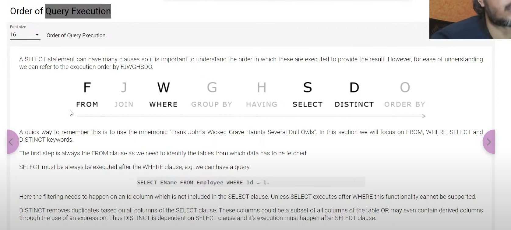

### CRUD

DML commands

1. Create Data - using INSERT - single value or multiple values - In order or without order
   If you want to add values in any order then make sure you provice all the values for each column, similarly we can provide specific values only by providing specific column names in syntax
2. Read Data - SELECT
3. Update Data
4. Delete Data

### Import

**Mostly SELECT filters columns, WHERE filters rows.**

How to import data ?

rename the columns using AS

Add constant valued column

DISTINCT

DISTINCT Combo

WHERE

Comments in mysql --

Overall Filtering with rows and columns

### Query Execution Order

### IN and NOT IN
